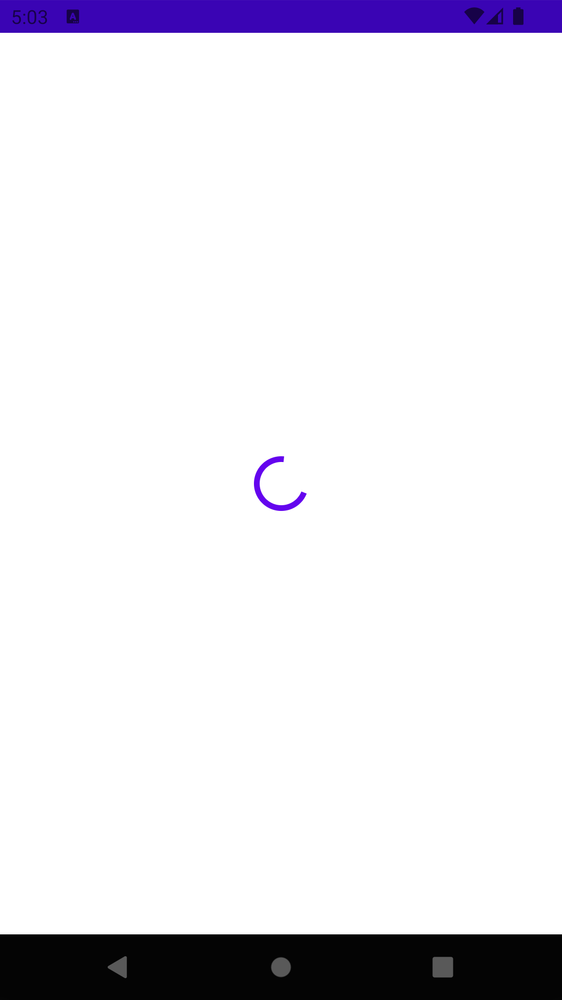
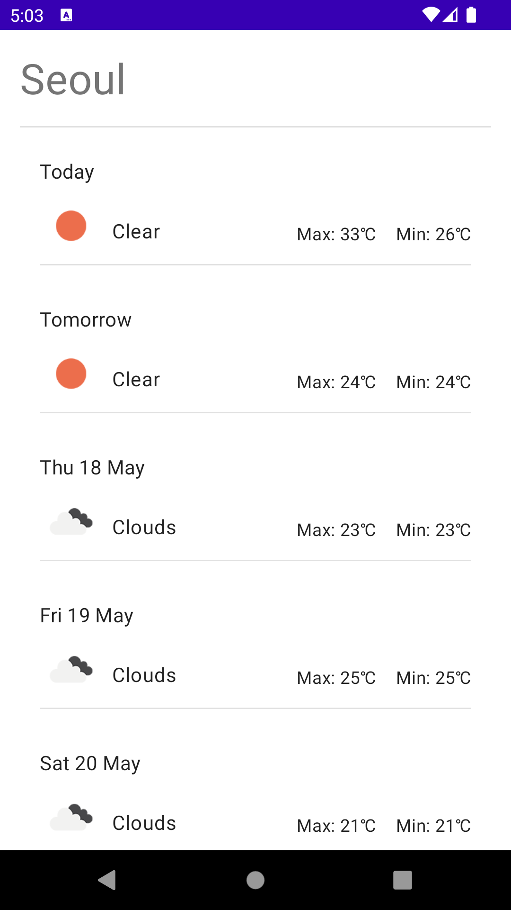

# kotlin-weather-list
- 패키지명: com.illis.weatherlist
- 버전: v1.0.0
- 기술: kotlin, MVVM, hilt, coroutine, flow, glide
- 프로젝트 설명, 기능:
    1. Seoul, London, Chicago, 세 도시의 날씨를 표시한다. 
    2. 위 도시 순서대로 오늘을 포함한 5일간의 날씨를 표시한다. 
    3. 총 3개 도시의 각 5일간의 날씨를 한 화면에 표시한다.

## Architecture
> ##### View (UI 화면)
>  - 날씨 목록 화면: MainActivity.kt
>
| 날씨 가져오기 로딩                      | 날씨 목록 화면                     |
|---------------------------------|------------------------------|
|  |  |

> ##### Model (서버 연동)
>  - Weather API DOC (https://openweathermap.org/forecast5)
>    - 서버 연동: RetrofitModule.kt
>      - remote: WeatherRepository.kt, WeatherRepositoryImpl.kt
>      - usecase: GetWeatherUseCase.kt
>    - 서버 기타
       >      - apis: WeatherApiService.kt
>      - 상수, 전역 변수: ServerConsts.kt
>      - 서버 예외 처리: ErrorInterceptor.kt
> ##### ViewModel (뷰 <-> 모델 데이터 관리)
>    - MainViewModel.kt
>      ```
>        val weatherList = getWeatherUseCase.getWeathers()
>        .stateIn(
>           initialValue = UiState.Loading,
>           started = SharingStarted.Lazily,
>           scope = viewModelScope
>        )
>      ```
> ##### Architecture
> : Clean Architecture, MVVM

## Structure
> ##### Project 구조
> - ``` java ```
>  - ``` com.illis.Weatherfinderapp ```
>     - ``` consts ``` : 상수 및 전역 변수
>     - ``` data ```
>       - ``` model ``` : Weather 데이터 모델 클래스
>       - ``` repository ``` : 서버 연동 & 데이터 전달하는 구현 클래스
>       - ``` source.remote.api ``` : 서버 API 사용 규격,
>       - ``` source.remote.interceptor ``` : 서버 mock, 예외 처리 클래스
>     - ``` domain ```
>       - ``` model ``` : 가공 모델 클래스
>       - ``` repository ``` : view에 데이터를 전달하기 위한 규격
>       - ``` usecase ``` : 비즈니스 로직
>     - ``` ui(presentation) ``` : 화면 처리
>
> ##### View 구조
> : Single Activity

## Environments
> - AGP Version (gradle-wrapper.properties): 7.4
> - Build Gradle Version (build.gradle): 7.3.1
> - Sdk Version: minSdkVersion 26, compileSdkVersion 33

## Open Source Dependencies
> ##### view
>  - "com.github.bumptech.glide:glide:4.14.2": 이미지 로드
> ##### 데이터 저장 및 관리
>  - "org.jetbrains.kotlinx:kotlinx-coroutines-android:1.6.4": 비동기 처리
>  - "androidx.activity:activity-ktx:1.7.1": 액티비티 api(viewModel) 지원
>  - "androidx.lifecycle:lifecycle-viewmodel-ktx:2.6.1": 데이터를 저장하고 변화를 관찰
> ##### 서버 연동
>  - 'com.squareup.retrofit2:retrofit:2.9.0': 서버 통신 지원
>  - 'com.squareup.okhttp3:okhttp:4.10.0': 서버 통신 지원
>  - 'com.squareup.okhttp3:logging-interceptor:5.0.0-alpha.6': 서버 통신 로깅 지원
> ##### di
>  - "com.google.dagger:hilt-android:2.44.2": 객체 의존성 주입 툴
> ##### 로그
>  - 'com.jakewharton.timber:timber:5.0.1': 로그 툴

## Documents
- 원격 저장소: https://github.com/12121s/kotlin-weather-list.git (private)